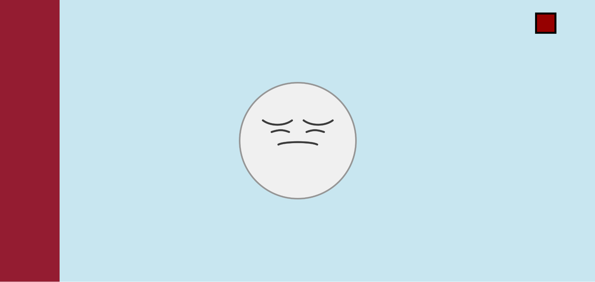
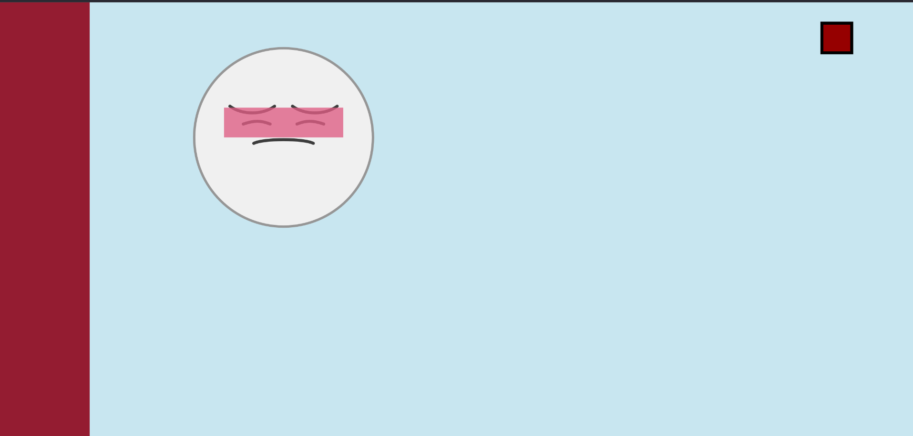
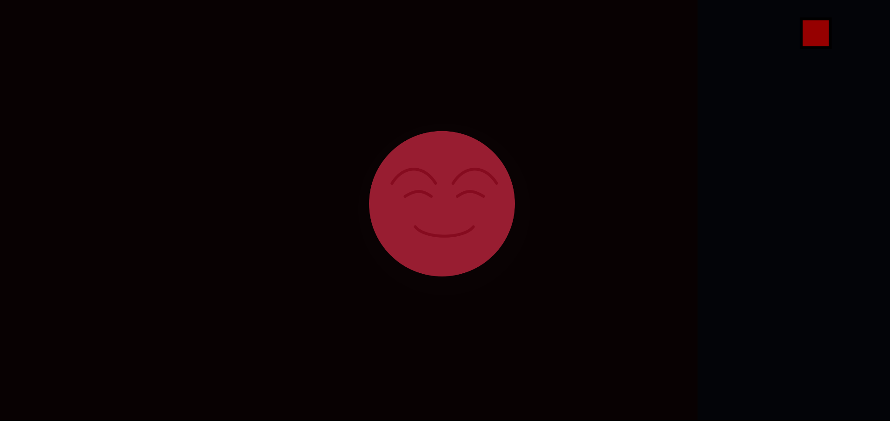

# TITLE OF PROJECT

Felix Dionne

[View this project online](http://127.0.0.1:5501/template-p5-project/)

## Description

This is a Shy Little Guy. He doesn’t like being in the spotlight — he feels much more comfortable hidden away or in the dark.
Luckily for him, there are two interactive elements that can help keep him cozy. In the top-right corner, there’s a light switch. I highly recommend trying it — the Shy Little Guy is much happier when the lights are off.

You can also try moving him around the screen. He might even manage to hide off-screen! But be careful: he doesn’t love being touched. If you hold him too long, he blushes quite a lot.

There’s also a curtain on the right side of the screen that you can drag over to help him feel safer. He gets extra cozy when hidden behind it. For maximum happiness, try combining both — lights off and curtain closed. Just keep in mind: when the lights are off, you can’t move him or the curtain, so place him where you want before flipping the switch. And since the curtain doesn’t stay shut forever, you’ll need to turn the lights back on now and then to keep him at peak comfort.

> I had a lot of fun making this project! I focused more on interactivity and functionality than style or flashy visuals.

> The user can interact with the Shy Guy, the light switch, and the curtain. The Shy Guy can be dragged around but not moved outside the window’s borders, and he blushes if held for too long. The light switch toggles the lights — when they’re off, the cursor acts like a flashlight, cutting a circle of light through the darkness. Finally, the curtain can be pulled over from the right side, but it won’t stay too far left or right, and will slowly pull itself back over time.

## Screenshot(s)

